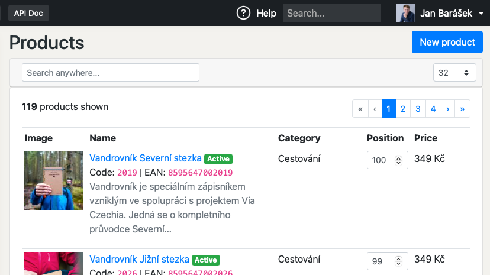
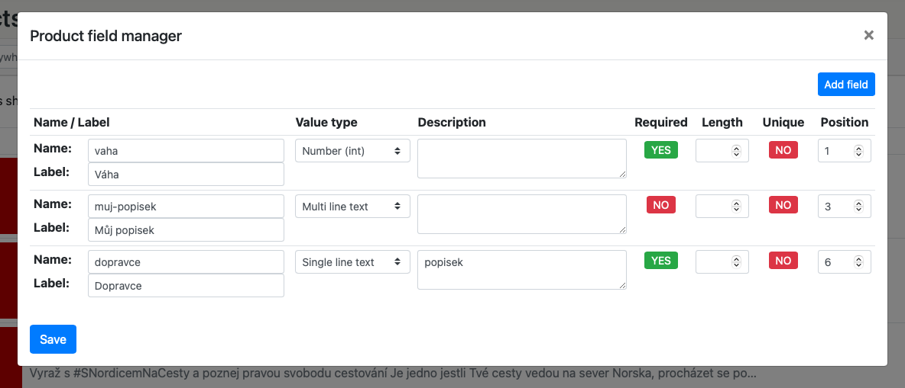
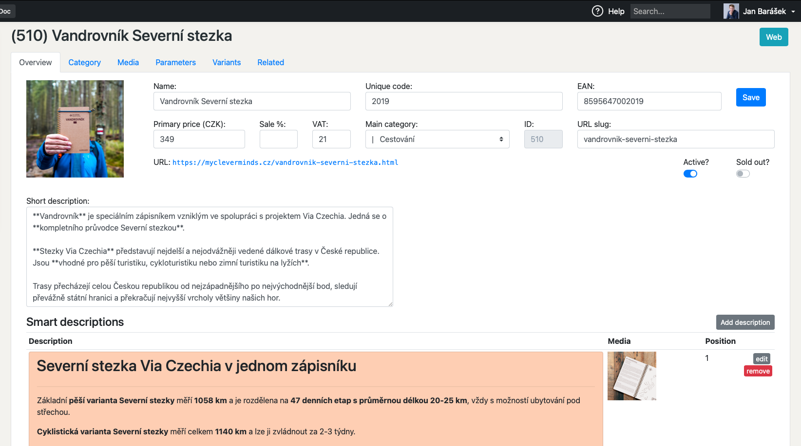
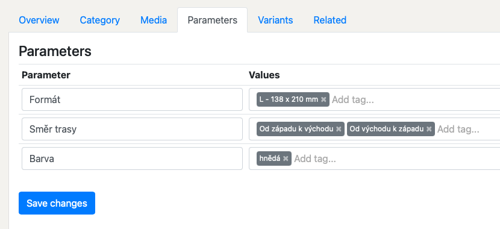

Baraja e-shop product
=====================

Advanced product manager with administration interface in PHP. Compatible with Baraja CMS.

📦 Installation
---------------

It's best to use [Composer](https://getcomposer.org) for installation, and you can also find the package on
[Packagist](https://packagist.org/packages/baraja-core/shop-product) and
[GitHub](https://github.com/baraja-core/shop-product).

To install, simply use the command:

```shell
$ composer require baraja-core/shop-product
```

You can use the package manually by creating an instance of the internal classes, or register a DIC extension to link the services directly to the Nette Framework.

How to use
----------

Install the package in your PHP application and register the services. If you are using Baraja CMS, the installation will be fully automatic.

The tool natively supports product creation, search, management and advanced editing.

Product Overview:



Custom user fields:



Details of specific product settings:



Manage parameters and variants:



📄 License
-----------

`baraja-core/shop-product` is licensed under the MIT license. See the [LICENSE](https://github.com/baraja-core/template/blob/master/LICENSE) file for more details.
